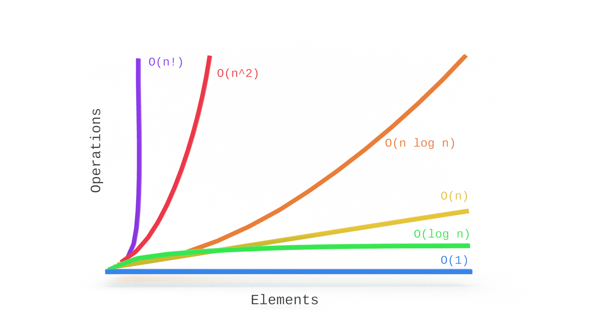

# Big O Notation, what is it ?

The Big O Notation are a set of notations that aim to say how much a function or algorithm is scalable in relation to the execution time, thus it is categorized into several types of notations that are: constants O(1), linear O(n ), quadratics O(n^2), logarithms O(log n) , exponentials O(2^n) and factorials O(n!)

#### Prior knowledge

In order for you to get a better interpretation of the knowledge taught here, you will need some prior knowledge:

* Elements 
* Arrays
* Arrow Function ()
* Loops
* If/Else
* Javascript methods ( For, Map, Find, While, Shift)

Note: As an example I used a JavaScript programming language, but it is possible and important to use this knowledge in any programming language that has time manipulation of functions and algorithms with percussion in elements

All this knowledge is above it is possible to find in JavaScript at the link [Developer Mozilla](https://developer.mozilla.org)

## Why is Big O important ?

The importance of big o regarding the creation of a code is to determine what is the best way to use the data in relation to the performance of the time, that's why it is usually used in the creation or refactoring of codes that manipulate data, which are usually involved in loops , for this reason it is important that your scalability is at high performance, or the best possible performance for that situation

#### Example in the algorithm

As an example, I'm going to use a function with algorithmic scalability, but you don't need to pay attention to the terms, but to the example and the use of the function.

This function aims to find an element without an array.

```js
const findElement = (array, element) => {

let elementFind

  for(let j = 0; j < array.length; j++){
      for (let i = 0; i < array.length; i++){
        if (element === array[i]) {
          elementFind = array[i]
        }
      }
  }

  return elementFind || 'There is no such element in the array'
}
```

What do you think of her ? Does it look optimized?

If you don't know the concepts of time complexity you may say that you don't have any problem with it, or that maybe one adjustment or another would be good, but I'll tell you for sure! This function is not performance-optimized with respect to its runtime and data handling.

Note, for each element that the forEach is passing from the array, a new for loop will be performed to finally compare the element and find it, Big O Notation would say that this situation is an 
O(n^2) but don't worry about the notation, I'll explain it again later.

Now look at this other function

```js
const findElement = (array, element) => {

  let elementFind

  for (let i = 0;  i < array.length; i++) {
    if (element === array[i]) {
      elementFind = array[i]
    }	
  }

  return elementFind || 'There is no such element in the array'
}
```

Now this is actually optimized, using only one loop for the same purpose, thus saving time and data usage.

It is still possible to optimize through the javascript find method, this method executes a loop checking if the requested condition is true, if it is the current loop element it will be returned, avoiding going to the end of the loop as our previous functions did.

The function would look like this:

```js
const findElement = (array, element) => {
  return array.find(currElement => currElement === element) ||  'There is no such element in the array'
}
```

## Constants O(1)

Constant algorithms or constant functions are those whose performance time will always be the same, in the case of a function, regardless of the number of entries in it, the time to execute it will be the same.

Note this function:

```js
const firstElement = (array) => {
  return array[0]
}

console.log(firstElement([0,1,2]))
// expected output: 0
```

Regardless of the number of elements in the array, this function will always return its first element, so its execution time will always be constant.

Another example of O(1) using javascript methods is the shift method, which will always remove the first element of the array, no matter how big the array is.

```js
const array1 = ["Green", "Blue", "Purple", "Black", "White", "Pink"]

array1.shift() 

console.log(array1)

// expected output: ["Blue", "Purple", "Black", "White", "Pink"]
```

#### Why does this constancy happen?

Methods such as forEach, find, map, filter, etc... Go through the elements of the array, this makes the amount of elements that will be traversed to increase depending on the amount in your input, this makes the runtime increase and consequently its complexity. However, in an O(1) notation method or algorithm, if there is one or more elements in its input, the execution will be at the same time, this happens because most of the times it is a method with fixed manipulation, that is, it it is always executed with the same element, the one that does not need to be traversed.

Note: The methods that occur in loop will be explained later
#### Demo chart

In this graph we can see the performance of operations by elements, later I will explain about the other notations, but note that the blue line that demonstrates the O(1) notation and note that regardless of the amount of incoming elements, the amount of operations remain the same and hence the runtime.



## Linear O(n)

This type of algorithm receives its name because its performance time scalability is linearly increasing in relation to the amount of elements entering the function or algorithm, that is, for each element entering its time performance will increase linearly.

#### How does it work ?

Generally linear functions interact with each incoming element for this reason, the more elements, the more operations.

Note this function

```js
const elementToIndex = (array) => { 
  for ( let i = 0; i < array.length ) {  
    array[i] = i  
  }

  return array
  }
  console.log(elementToIndex(["Red"]))
  // expected output = [1]
  console.log(elementToIndex(["Red", "Blue"]))
  // expected output = [1, 2]
  console.log(elementToIndex(["Red", "Blue", "Pink"]))
  // expected output = [1, 2, 3]
```

As you can see the function creates a loop, this is executed by passing each element of the array and changing the element so that it matches its index. Thinking in terms of time stability, the first function call has only one element, applying the change only to it, in the second it has two elements increasing the execution time by 100% because now you will have to do the same process in the second element, the same occurs in relation to the third call, the time comparison is 200% greater for the third call in relation to the first, this is because for each additional element in the input the execution time will increase linearly proportionally.

Another example in a javascript method is the map, this method iterates through each element of an array, applying any modification you define on the element, note:

```js
const array = [5, 10, 20]

const newArray = array.map(element => element * 2)

console.log(newArray)
// expected output = [10, 20, 40]
```

As you can see, the method iterates through each element of the array, that is, an O(n), multiplying each element by 2.

## Quadratic O(n^2)

This type of algorithm is characterized by scaling its interactions with each incoming element in a quadratic way, if you enter 2 elements there will be 4 operations because in 2^2 = 4, if you enter 10 elements there will be 100 operations, because 10^2 = 100 and so on.

#### How does it work in practice ?

At the end of a school's school year, we have the final result in an array in the pass list and another array with the list of class participants, but we need a list of those who failed and for this it will be necessary to check for each student if he is or not on the pass list, if not, you will be pulled to the fail list.

Watch:

```js
const approved = ['Ashley', 'Oliver', 'John', 'Sandy', 'Scarlett']

const allEnrolled = ['Ashley', 'Oliver', 'Michael', 'Carly', 'Sandy', 'Scarlett', 'Caitlin', 'John']

const disapprove = []

for (let i = 0; i < allEnrolled.length; i++) {

  let approvedParticipant = false

  for (let j = 0; j < approved.length; j++) {
    if (allEnrolled[i] === approved[j]) {
      approvedParticipant = true
    }
  }

  if (!approvedParticipant) {
    disapprove.push(allEnrolled[i])
  }
}

console.log(disapprove)
// expected output = ["Michael, "Carly", "Caitlin"]
```

First, we go through each student in the list of participants and for each student a sub-interaction with a support list is necessary, so that it can be verified if the student passed or not, not great, we call this notation O (n ^ 2) because for each element there is a sub-interaction that is, a loop inside the other.

## Logarithmic O(log n)

This type of function or algorithm has a different behavior from the previous ones and also has a better performance in relation to time.

So far we have seen the degree of complexity of the functions growing and their performance decreasing because the number of operations were greater than the incoming elements, but for the logarithmic functions this happens differently, since the number of operations decreases with time, so always the number of operations will be less than the number of elements for that type of function.

Note the function below

```js
const binarySearch = (array, element) => {
        let low = 0
        let high = array.length - 1
        while(low <= high){
            let mid = Math.floor((low + high) / 2)
            if(array[mid] === element){
                return mid
            }
            if(array[mid] < element){
                low = mid + 1
            }else{
                high = mid - 1
            }
        }
        return -1
    }
console.log(binarySearch([1, 2, 3, 4, 5, 6], 5))
// expected output = 5
```

It has as input an ordered array and an element, this function aims to find the input element inside the array, so it doesn't have to go through the array element by element, which would be the case of O(n), it takes the element central of the array and checks if it's larger or smaller than the element we're requesting, that way it can eliminate half of the elements by knowing which side to look for in your next search

Note: Despite being very performative, it is not always possible to create this type of function, in this case it was necessary to have an ordered array, for this reason it is possible to go linearly decreasing the number of elements, because we know which side to look for, eliminating the number of elements for each loop

## Logarithmic O(log n)